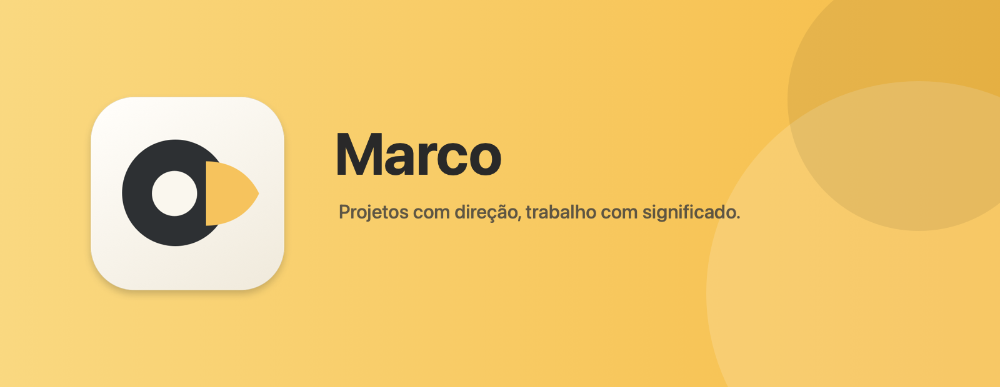
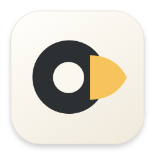

<p align="center">
  
</p>

<h1 align="center">Marco</h1>

<p align="center">
  <strong>Projetos com direção, trabalho com significado.</strong><br>
  Um espaço visual para planejar o caminho, escolher o que merece foco agora<br>
  e transformar trabalho cotidiano em progresso que pode ser visto.
</p>

<p align="center">
  
  
  
  
</p>

<p align="center">
  <a href="#sobre-o-marco">Sobre</a> ·
  <a href="#o-que-o-marco-reúne">Funcionalidades</a> ·
  <a href="#executando-localmente">Desenvolvimento</a> ·
  <a href="#downloads">Downloads</a> ·
  <a href="#contribuindo">Contribuição</a> ·
  <a href="https://github.com/RenatoCesarF/marco-landing-page/issues/new">Suporte</a>
</p>

---

## Sobre o Marco

O **Marco** é um aplicativo de organização de projetos criado para responder a três perguntas sem transformar o trabalho em uma coleção de painéis cinzas:

1. **Onde o projeto quer chegar?**
2. **Qual é o próximo marco do caminho?**
3. **No que vale a pena trabalhar agora?**

Em vez de tratar tarefas, tempo, registros e planejamento como ferramentas separadas, o Marco reúne tudo em um mesmo contexto. Marcos viram checkpoints visuais, tarefas vivem dentro do plano, o foco atual fica sempre acessível e o histórico preserva não só o que foi concluído, mas também como o projeto evoluiu.

O resultado é uma experiência **visual, calma e intencional**, feita primeiro para macOS e orientada por uma ideia simples: produtividade não deveria esconder o significado do trabalho.

> O Marco não foi pensado para fazer você gerenciar mais. Foi pensado para ajudar você a enxergar melhor.

## A ideia central

| Princípio | Como aparece no produto |
| --- | --- |
| **O caminho precisa ser visível** | Marcos dividem o projeto em checkpoints e formam um roadmap de 0 a 100%. |
| **O presente vem primeiro** | A tarefa em foco, o próximo passo e o timer permanecem acessíveis sem disputar atenção com o resto. |
| **Contexto também é trabalho** | Diário, posts, notas, lembretes e atividades preservam decisões, ideias e aprendizados. |
| **Os dados pertencem ao usuário** | O aplicativo trabalha com dados locais, backups portáteis, migrações versionadas e recuperação. |

## O que o Marco reúne

### Um plano único para marcos e tarefas

Marcos e tarefas vivem na mesma lista. É possível criar tarefas avulsas, agrupá-las por marco, reorganizar o plano por arrastar e soltar e manter o que já foi concluído com menos destaque — sem perder o histórico.

### Roadmap como parte do progresso

Cada marco se torna um checkpoint dentro da própria linha de progresso. Assim, o projeto deixa de ser apenas uma porcentagem e passa a mostrar **o que já foi atravessado, onde você está e o que ainda falta**.

### Foco e tempo integrados ao macOS

Escolha uma tarefa em foco, inicie o timer e continue acompanhando o trabalho pela barra superior do sistema. Ao mudar o foco, o Marco pausa a atividade anterior e mantém apenas uma tarefa em andamento.

### Diário rico e contextual

Registre o processo com texto formatado, títulos, links, imagens e humor opcional. Entradas longas aparecem de forma resumida e podem ser abertas por inteiro quando você quiser revisitar o contexto.

### Posts, notas e lembretes

- **Posts** organizam comunicados e registros mais estruturados.
- **Notas** funcionam como uma folha contínua para links, ideias e rascunhos.
- **Lembretes** destacam o que precisa voltar à sua atenção e podem gerar notificações reais do macOS.

### Linha do tempo de atividades

Criação e conclusão de tarefas e marcos, entradas de diário, posts e outras decisões importantes formam uma linha do tempo navegável. As atividades possuem links para o conteúdo que as originou.

### Busca global

Use <kbd>⌘</kbd> + <kbd>K</kbd> para procurar projetos, tarefas, marcos, posts, diários e lembretes. Os resultados são agrupados por projeto, identificados por ícones e navegáveis pelo teclado.

### Identidade própria para cada projeto

Cor principal, banner e imagem quadrada ajudam cada projeto a construir uma presença visual própria. O objetivo é que trabalhar em projetos diferentes também pareça diferente.

### Progresso de tempo que conta uma história

Além do tempo acumulado, o Marco transforma as sessões em visualizações que ajudam a entender ritmo, distribuição e evolução — e permite corrigir durações quando um timer fica ligado por engano.

### Local-first e preparado para recuperação

Os dados ficam no computador do usuário. O projeto inclui esquema versionado, plano de migração, recuperação quando o banco não abre e exportação/importação de backup para reduzir o risco de perda de trabalho.

### Feito para diferentes formas de trabalhar

O aplicativo oferece temas e interface em **português brasileiro, inglês e espanhol**, configuráveis pelo próprio Marco.

## Este repositório

Este é o repositório da **landing page oficial do Marco**: a apresentação pública do produto, o ponto de acesso aos downloads e o caminho para suporte e feedback.

A página foi construída para refletir a mesma identidade do aplicativo — amarelos quentes, superfícies claras, formas generosas e uma comunicação direta — sem depender de backend ou de um sistema de conteúdo.

### Objetivos da landing page

- Explicar a proposta do Marco antes de listar funcionalidades.
- Demonstrar visualmente como projetos, marcos e foco se conectam.
- Disponibilizar versões do aplicativo para download.
- Centralizar suporte, bugs e sugestões nas issues do GitHub.
- Servir como base estática, rápida e simples de publicar.

## Stack

| Tecnologia | Papel |
| --- | --- |
| [Astro 7](https://astro.build/) | Estrutura, build e geração do site estático. |
| HTML semântico | Conteúdo acessível e bem estruturado. |
| CSS | Identidade visual, responsividade e animações. |
| JavaScript | Interações pontuais da página. |
| GitHub Issues | Canal público de suporte e feedback. |

A landing não exige banco de dados, servidor de aplicação ou runtime em produção. Depois do build, todo o conteúdo fica disponível como arquivos estáticos dentro de `dist/`.

## Estrutura do repositório

```text
.
├── public/
│   ├── downloads/          # Instaladores publicados
│   ├── favicon.ico         # Ícone do navegador
│   ├── marco-icon.png      # Logo oficial do aplicativo
│   └── readme-banner.png   # Banner usado neste README
├── src/
│   └── pages/
│       └── index.astro     # Landing page
├── astro.config.mjs
├── package.json
└── tsconfig.json
```

## Executando localmente

### Pré-requisitos

- [Node.js](https://nodejs.org/) **22.12 ou superior**
- npm

### Instalação

```bash
git clone https://github.com/RenatoCesarF/marco-landing-page.git
cd marco-landing-page
npm install
npm run dev
```

O Astro exibirá o endereço local no terminal — normalmente `http://localhost:4321`.

## Comandos disponíveis

| Comando | O que faz |
| --- | --- |
| `npm run dev` | Inicia o ambiente local com atualização automática. |
| `npm run build` | Gera a versão estática de produção em `dist/`. |
| `npm run preview` | Abre localmente o último build de produção. |
| `npm run astro -- --help` | Exibe os comandos disponíveis do Astro. |

## Build de produção

```bash
npm run build
npm run preview
```

Antes de publicar, verifique a página em diferentes larguras de tela e confirme se os arquivos de download estão presentes em `public/downloads/`.

## Downloads

A landing já está preparada para oferecer versões do Marco para três plataformas:

| Plataforma | Arquivo esperado | Situação |
| --- | --- | --- |
| macOS | `public/downloads/Marco-macOS.dmg` | Plataforma principal; distribuição em preparação. |
| Windows | `public/downloads/Marco-Windows.exe` | Planejado. |
| Linux | `public/downloads/Marco-Linux.AppImage` | Planejado. |

Os nomes acima correspondem aos links usados pela página. Para publicar uma nova versão, substitua o respectivo instalador mantendo o nome esperado ou atualize o link em `src/pages/index.astro`.

> **Nota sobre segurança no macOS:** enquanto o aplicativo não estiver assinado e notarizado pela Apple, o sistema poderá exibir um aviso ao abrir o instalador. A distribuição pública definitiva deverá usar assinatura, notarização e um canal claro de versões.

## Deploy

Por gerar somente arquivos estáticos, a landing pode ser publicada em serviços como Vercel, Netlify ou Cloudflare Pages.

| Configuração | Valor |
| --- | --- |
| Comando de instalação | `npm install` |
| Comando de build | `npm run build` |
| Diretório de publicação | `dist` |
| Versão do Node.js | `22.12` ou superior |

Nenhum adaptador de servidor é necessário para o estado atual do projeto.

## Privacidade

No estado atual, a landing page:

- não possui formulários de cadastro;
- não utiliza cookies próprios;
- não inclui analytics ou rastreadores;
- não envia dados para um backend;
- direciona suporte e feedback para o GitHub.

Essa simplicidade é intencional e acompanha a proposta local-first do Marco. Caso integrações sejam adicionadas no futuro, esta seção e a política pública de privacidade deverão ser atualizadas antes do deploy.

## Roadmap

- [x] Landing responsiva com a identidade visual do Marco.
- [x] Projeto Astro com build estático reproduzível.
- [x] Logo, favicon e banner oficiais do aplicativo.
- [x] Canal de suporte conectado às issues do GitHub.
- [ ] Publicar o primeiro instalador do macOS.
- [ ] Assinar e notarizar o aplicativo para distribuição segura.
- [ ] Adicionar screenshots e demonstrações atualizadas do produto.
- [ ] Preparar versões para Windows e Linux.
- [ ] Documentar o processo público de releases e checksums.

O roadmap pode mudar conforme o produto amadurece. Bugs, sugestões e discussões devem começar em uma [nova issue](https://github.com/RenatoCesarF/marco-landing-page/issues/new).

## Contribuindo

Contribuições são bem-vindas, especialmente para acessibilidade, responsividade, performance, clareza do conteúdo e consistência visual.

1. Confira as [issues existentes](https://github.com/RenatoCesarF/marco-landing-page/issues).
2. Para uma mudança maior, abra uma issue antes de começar para alinhar a proposta.
3. Faça um fork do repositório.
4. Crie uma branch descritiva, como `feat/nova-secao` ou `fix/menu-mobile`.
5. Rode `npm run build` antes de enviar a mudança.
6. Abra um pull request explicando o problema, a solução e como você verificou o resultado.

Ao alterar a interface, inclua imagens ou uma gravação curta no pull request sempre que isso ajudar a comparar o antes e o depois.

## Repositórios

- **Landing page:** [RenatoCesarF/marco-landing-page](https://github.com/RenatoCesarF/marco-landing-page)
- **Aplicativo para macOS:** [RenatoCesarF/Marco](https://github.com/RenatoCesarF/Marco)

## Suporte e feedback

Encontrou um problema, teve uma ideia ou quer sugerir uma melhoria?

[**Abra uma issue no GitHub →**](https://github.com/RenatoCesarF/marco-landing-page/issues/new)

Para facilitar o diagnóstico, inclua uma descrição clara, passos para reproduzir o problema, comportamento esperado e, quando possível, uma captura de tela.

## Licença

Este repositório ainda não possui uma licença de código aberto definida. Até que um arquivo `LICENSE` seja publicado, todos os direitos permanecem reservados ao autor. Se você deseja reutilizar ou distribuir parte deste projeto, abra uma issue para conversar sobre a autorização adequada.

---

<p align="center">
  <br>
  <strong>Marco</strong><br>
  <sub>Menos ruído. Mais direção.</sub>
</p>
